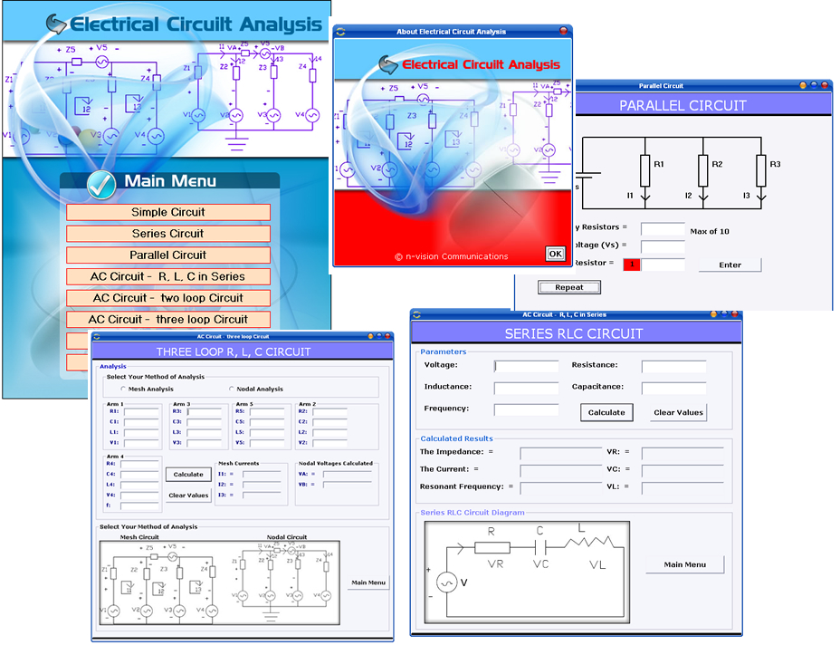



## Analysis and Modelling of Electrical Circuit

### Description

Analysis and Modelling of Electrical Circuit

----

-- Simple Circuit

-- Series Cicruit

-- Parallel Circuit

-- AC Circuit - R, L, C in Series

-- AC Circuit - two loop Circuit

-- AC Circuit - three loop Circuit

----

With the use of Mesh and Nodal Analysis Method
 
### More Info
 

             |
---                |---
**Submitted On**   |2008-01-19 23:57:20
**By**             |[Oyafajo Akinkunle](https://github.com/Planet-Source-Code/PSCIndex/blob/master/ByAuthor/oyafajo-akinkunle.md)
**Level**          |Intermediate
**User Rating**    |4.5 (27 globes from 6 users)
**Compatibility**  |VB 6\.0
**Category**       |[Math/ Dates](https://github.com/Planet-Source-Code/PSCIndex/blob/master/ByCategory/math-dates__1-37.md)
**World**          |[Visual Basic](https://github.com/Planet-Source-Code/PSCIndex/blob/master/ByWorld/visual-basic.md)
**Archive File**   |[Analysis\_a2098361202008\.zip](https://github.com/Planet-Source-Code/oyafajo-akinkunle-analysis-and-modelling-of-electrical-circuit__1-69945/archive/master.zip)

